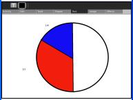
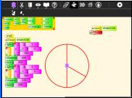
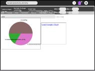
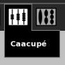

# Fractions 
Suggested for school years 6 - 8

## The Fraction abacus
Start Abacus , 

select the Fraction abacus.

Slide one of the 1/2 beads to represent 1/2

Another way to represent 1/2 is to slide half of another string of fraction beads, for example, slide 2 of the 1/4 beads. That is (2 x 1)/4 = 2/4 = 1/2

How many ways can you make 1/2, remember you can use 2 strings eg. 1/3 + 1/6 = 1/2

If using just one string, only some of the strings of beads can be used to make 1/2. Which ones? Why? 

Show that the solutions which use more than one string are correct, use the Lowest Common Denominator [LCD](http://en.wikipedia.org/wiki/Lowest_common_denominator) method, for example for the case of 1/3 +1/6 = 1/2
 1/3 + 1/6 =
 2/6 + 1/6 =
 (2+1)/6 =
 3/6 =
 1/2

How do you know if you have found all the solutions? 

Find all the ways to make 1/3 and 2/3

## Other representations of fraction addition
Draw your solutions as pie charts, you can use Paint, TurtleArt, Socialcalc or Gnumeric in Gnome.

 |   |  

The Caacupé abacus
Load the Caacupé abacus 

It can represent negative whole numbers and fractions. 1/2 can be represented as 10 - 9 - 2/3 + 1/6

How many different ways can you represent 1/2, 1/3, 2/3

How do you know when you have found them all?

Similar to the Pie chart, can you think of a way to visually represent the addition of positive and negative fractions?

see the [answersheet](https://wiki.sugarlabs.org/go/Activities/Abacus/Worksheet/Answersheet)

